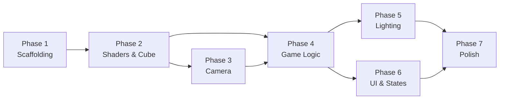

# 3D Tower Stacker — Phased Implementation Plan

## Goal

Build a complete, polished **3D Tower Stacker** arcade game using **C++17** and **OpenGL 3.3 Core Profile** with **GLFW**, **GLAD**, and **GLM**. The plan is divided into **7 self-contained phases**, each designed so that any capable AI agent can execute it independently without exceeding its context window.

> [!IMPORTANT]
> Each phase produces a **compilable, runnable checkpoint**. No phase depends on reading the full codebase from previous phases — only the public headers and data structures listed in its "Context Required" section.

---

## Technology Stack

| Component | Choice | Rationale |
|-----------|--------|-----------|
| Language | C++17 | Modern features (structured bindings, `std::optional`, `if constexpr`) |
| Graphics API | OpenGL 3.3 Core Profile | Wide hardware support, no legacy fixed-function |
| Windowing | GLFW 3.4+ | Cross-platform, clean callback API |
| GL Loader | GLAD (generated for GL 3.3 Core) | Lightweight, single-file |
| Math | GLM 0.9.9+ | Industry-standard, header-only |
| Build System | CMake 3.15+ | Target-based modern CMake |
| Dependency Mgmt | Manual `third_party/` vendoring | Simple, no external tooling required |

## Final Project Structure (Target)

```
TowerStacker/
├── CMakeLists.txt
├── README.md
├── assets/
│   └── shaders/
│       ├── block.vert
│       ├── block.frag
│       ├── text.vert          # Phase 6
│       └── text.frag          # Phase 6
├── third_party/
│   ├── glad/
│   │   ├── include/
│   │   └── src/glad.c
│   └── glm/                   # Header-only, or find_package
├── include/
│   ├── Game.h
│   ├── Renderer.h
│   ├── Block.h
│   ├── Camera.h
│   ├── Shader.h
│   ├── InputHandler.h
│   ├── TextRenderer.h         # Phase 6
│   └── Utils.h
└── src/
    ├── main.cpp
    ├── Game.cpp
    ├── Renderer.cpp
    ├── Block.cpp
    ├── Camera.cpp
    ├── Shader.cpp
    ├── InputHandler.cpp
    ├── TextRenderer.cpp        # Phase 6
    └── Utils.cpp
```

---

## Phase Overview

| Phase | Title | Deliverable | Estimated Complexity |
|-------|-------|-------------|---------------------|
| 1 | Project Scaffolding & Window | Empty window with OpenGL context, CMake builds | Low |
| 2 | Shader System & Unit Cube Rendering | Colored cube on screen with MVP pipeline | Medium |
| 3 | Camera System | Perspective camera with smooth vertical tracking | Medium |
| 4 | Core Game Logic (Block Stacking & Shearing) | Playable stacking with overlap detection | High |
| 5 | Lighting, Materials & Visual Polish | Phong lighting, rainbow colors, falling scraps | Medium-High |
| 6 | UI, Scoring & Game States | Start screen, score HUD, game over, restart | Medium |
| 7 | Polish, Performance & Packaging | Difficulty scaling, particles, README, build | Low-Medium |

---

## Phase 1 — Project Scaffolding & Window Initialization

### Objective
Set up the full project skeleton, CMake build system, vendored dependencies, and open a resizable GLFW window with an OpenGL 3.3 Core context that clears to a dark background.

### Context Required
- None (greenfield).

### Files to Create

#### [NEW] `CMakeLists.txt`
- `cmake_minimum_required(VERSION 3.15)`
- Project name: `TowerStacker`, language: `CXX`
- Set `CMAKE_CXX_STANDARD 17`
- Add GLAD as a static library from `third_party/glad/`
- Find or add GLFW and GLM
- Create executable target from `src/main.cpp`
- Link: `glfw`, `glad`, `glm::glm` (or header-only include), `opengl32` on Windows

#### [NEW] `third_party/glad/` 
- Generate GLAD files from [glad.dav1d.de](https://glad.dav1d.de/) for **GL 3.3 Core**, language **C/C++**, loader **ON**
- Place `glad.c` in `third_party/glad/src/`
- Place headers in `third_party/glad/include/glad/` and `third_party/glad/include/KHR/`

#### [NEW] `src/main.cpp`
```cpp
// Responsibilities:
// 1. Initialize GLFW with OpenGL 3.3 Core hints
// 2. Create 800x600 window titled "3D Tower Stacker"
// 3. Make context current, load GLAD
// 4. Set viewport, register framebuffer resize callback
// 5. Enter main loop: glClear(GL_COLOR_BUFFER_BIT | GL_DEPTH_BUFFER_BIT)
// 6. Swap buffers, poll events
// 7. Cleanup on exit
```

#### [NEW] `include/Utils.h` & `src/Utils.cpp`
- Delta-time calculation helper: `float calculateDeltaTime()`
- Error-checking wrapper: `void glCheckError(const char* file, int line)`
- `#define GL_CHECK_ERROR() glCheckError(__FILE__, __LINE__)`

### Acceptance Criteria
- [x] `cmake --build .` succeeds with zero errors and zero warnings
- [x] Running the executable opens an 800×600 window with a dark blue/gray background
- [x] Window is resizable and viewport updates correctly
- [x] ESC key closes the window
- [x] `glGetString(GL_VERSION)` prints OpenGL 3.3+ to console on startup

### Key Implementation Details
- **GLAD must be included before GLFW** in every file
- Enable depth testing: `glEnable(GL_DEPTH_TEST)`
- Set clear color: `glClearColor(0.1f, 0.1f, 0.15f, 1.0f)`
- Use `glfwSetFramebufferSizeCallback` for resize handling

---

## Phase 2 — Shader System & Unit Cube Rendering

### Objective
Implement a reusable `Shader` class, define a unit cube with proper normals via VBO/VAO/EBO, and render a single colored cube using an MVP matrix pipeline. No lighting yet — just flat color passed via uniform.

### Context Required
- Phase 1 file structure and `main.cpp` loop
- `Utils.h` for error checking

### Files to Create / Modify

#### [NEW] `include/Shader.h` & `src/Shader.cpp`
```cpp
class Shader {
public:
    unsigned int ID;
    Shader(const char* vertexPath, const char* fragmentPath);
    void use() const;
    void setBool(const std::string& name, bool value) const;
    void setInt(const std::string& name, int value) const;
    void setFloat(const std::string& name, float value) const;
    void setVec3(const std::string& name, const glm::vec3& value) const;
    void setVec4(const std::string& name, const glm::vec4& value) const;
    void setMat4(const std::string& name, const glm::mat4& value) const;
    ~Shader();  // calls glDeleteProgram
private:
    void checkCompileErrors(unsigned int shader, const std::string& type);
};
```
- Read shader source from file using `std::ifstream`
- Compile vertex & fragment shaders with full error logging
- Link into program, check link errors

#### [NEW] `assets/shaders/block.vert`
```glsl
#version 330 core
layout (location = 0) in vec3 aPos;
layout (location = 1) in vec3 aNormal;

uniform mat4 model;
uniform mat4 view;
uniform mat4 projection;

out vec3 FragPos;
out vec3 Normal;

void main() {
    FragPos = vec3(model * vec4(aPos, 1.0));
    Normal = mat3(transpose(inverse(model))) * aNormal;
    gl_Position = projection * view * vec4(FragPos, 1.0);
}
```

#### [NEW] `assets/shaders/block.frag`
```glsl
#version 330 core
out vec4 FragColor;

uniform vec3 objectColor;
// Lighting uniforms will be added in Phase 5

void main() {
    FragColor = vec4(objectColor, 1.0);
}
```

#### [NEW] `include/Renderer.h` & `src/Renderer.cpp`
```cpp
class Renderer {
public:
    Renderer();
    ~Renderer();
    void init();       // Create cube VAO/VBO/EBO
    void drawCube(const Shader& shader, const glm::mat4& model,
                  const glm::vec3& color) const;
    void cleanup();    // Delete VAO/VBO/EBO
private:
    unsigned int cubeVAO, cubeVBO, cubeEBO;
    void setupCubeMesh();
};
```
- **Unit cube**: vertices from (-0.5, -0.5, -0.5) to (0.5, 0.5, 0.5)
- **36 vertices** (6 faces × 2 triangles × 3 verts) with normals, OR indexed with EBO
- Vertex layout: `vec3 position`, `vec3 normal` (stride = 24 bytes)

#### [MODIFY] `src/main.cpp`
- Instantiate `Shader` and `Renderer`
- In the loop: draw a single cube at origin with a hardcoded model matrix
- Set `view = glm::lookAt(...)` and `projection = glm::perspective(...)` as temporaries

### Acceptance Criteria
- [x] A colored 3D cube is visible on screen from an angled perspective
- [x] Shader compilation errors are printed to `stderr` with line numbers
- [x] Model, View, Projection matrices are applied correctly (cube appears in 3D perspective)
- [x] No OpenGL errors reported by `glGetError()`

### Key Implementation Details
- Cube normals must point **outward** per face (critical for Phase 5 lighting)
- Use `glm::perspective(glm::radians(45.0f), aspectRatio, 0.1f, 100.0f)`
- Store shader file paths relative to executable or use a configurable asset path

---

## Phase 3 — Camera System

### Objective
Implement a `Camera` class that provides View and Projection matrices, supports smooth vertical tracking as the tower grows, and gives an isometric-like perspective view of the scene.

### Context Required
- `Shader` class (Phase 2) — `setMat4()` interface
- Main loop structure from Phase 1

### Files to Create / Modify

#### [NEW] `include/Camera.h` & `src/Camera.cpp`
```cpp
class Camera {
public:
    Camera(float fov = 45.0f, float aspect = 4.0f/3.0f,
           float near = 0.1f, float far = 200.0f);

    glm::mat4 getViewMatrix() const;
    glm::mat4 getProjectionMatrix() const;

    void setTargetY(float y);           // Called when a block is placed
    void update(float deltaTime);        // Smooth interpolation
    void setAspectRatio(float aspect);   // On window resize

private:
    // Position & orientation
    glm::vec3 position;      // e.g., (8, 12, 8) — isometric offset
    glm::vec3 lookOffset;    // Offset from position to look-at point
    float currentY;          // Current vertical position (animated)
    float targetY;           // Target vertical position
    float lerpSpeed;         // Interpolation speed (e.g., 5.0f)

    // Projection
    float fov, aspectRatio, nearPlane, farPlane;
};
```

**Camera behavior:**
- Fixed isometric-like angle: position is offset from the tower top (e.g., `(8, currentY + 10, 8)` looking at `(0, currentY, 0)`)
- When `setTargetY()` is called, `targetY` updates; `update()` lerps `currentY` toward it
- Lerp formula: `currentY += (targetY - currentY) * lerpSpeed * deltaTime`
- Clamp lerp to avoid overshooting

#### [MODIFY] `src/main.cpp`
- Replace hardcoded view/projection with `Camera` instance
- Call `camera.update(deltaTime)` each frame
- Pass `camera.getViewMatrix()` and `camera.getProjectionMatrix()` to shader
- Handle window resize → `camera.setAspectRatio(newAspect)`

### Acceptance Criteria
- [x] Camera provides a clear isometric-like 3D view of the cube(s) at origin
- [x] Calling `camera.setTargetY(5.0f)` smoothly pans the camera upward over multiple frames
- [x] Window resize correctly updates the projection aspect ratio (no stretching)
- [x] Camera movement is frame-rate independent (uses `deltaTime`)

### Key Implementation Details
- Use `glm::lookAt(position, lookAtPoint, glm::vec3(0,1,0))` for the view matrix
- The look-at point should track `currentY`, not `targetY`, for smooth visuals
- Lerp speed of ~5.0f gives a responsive but smooth feel

---

## Phase 4 — Core Game Logic (Block Stacking & Shearing)

### Objective
Implement the full game mechanic: block oscillation, drop action, overlap/shearing calculation, tower building, scrap piece creation, and game-over detection. This is the **largest and most critical phase**.

### Context Required
- `Shader` class — uniform setters
- `Renderer` class — `drawCube()` method signature
- `Camera` class — `setTargetY()`, `update()`, matrix getters
- Main loop structure

### Files to Create / Modify

#### [NEW] `include/Block.h` & `src/Block.cpp`
```cpp
struct Block {
    glm::vec3 position;     // Center of the block
    glm::vec3 size;         // Width (X), Height (Y), Depth (Z)
    glm::vec3 color;        // RGB color

    glm::mat4 getModelMatrix() const;
    // Returns: translate(position) * scale(size)
};

struct ScrapPiece {
    glm::vec3 position;
    glm::vec3 size;
    glm::vec3 color;
    glm::vec3 velocity;     // Falling velocity
    glm::vec3 rotationAxis;
    float rotationAngle;    // Accumulates over time
    float rotationSpeed;    // Degrees per second

    glm::mat4 getModelMatrix() const;
    void update(float deltaTime);
    bool isOffScreen() const; // position.y < -20.0f
};
```

#### [NEW] `include/InputHandler.h` & `src/InputHandler.cpp`
```cpp
class InputHandler {
public:
    static void init(GLFWwindow* window);

    static bool isDropPressed();   // Consumes the event (returns true once)
    static bool isRestartPressed();
    static bool isQuitPressed();

private:
    static bool dropRequested;
    static bool restartRequested;

    static void keyCallback(GLFWwindow* window, int key,
                           int scancode, int action, int mods);
    static void mouseButtonCallback(GLFWwindow* window, int button,
                                    int action, int mods);
};
```

#### [NEW] `include/Game.h` & `src/Game.cpp`
```cpp
enum class GameState {
    START_SCREEN,
    PLAYING,
    GAME_OVER
};

class Game {
public:
    Game();

    void init();
    void update(float deltaTime);
    void render(const Renderer& renderer, Shader& shader);
    void handleInput();

    GameState getState() const;
    int getScore() const;
    void setCamera(Camera* cam);

private:
    GameState state;
    int score;

    // Tower data
    std::vector<Block> towerBlocks;  // Placed blocks (bottom to top)
    Block currentBlock;               // The moving block
    float blockHeight;                // Constant (e.g., 0.3f)

    // Oscillation
    float oscillationTime;
    float oscillationSpeed;           // Increases with score
    float oscillationAmplitude;       // Range of movement (e.g., 3.0f)
    bool movingAlongX;                // Alternates: true=X, false=Z

    // Scrap pieces
    std::vector<ScrapPiece> scrapPieces;

    // Camera reference
    Camera* camera;

    // Private methods
    void startGame();
    void dropBlock();
    void spawnNextBlock();
    void updateOscillation(float deltaTime);
    void updateScrapPieces(float deltaTime);
    glm::vec3 getColorForLevel(int level) const;
};
```

### Core Algorithm — `dropBlock()`
```
1. Get the top block from towerBlocks (the "previous" block)
2. Determine axis: if movingAlongX → compare X, else → compare Z
3. Calculate overlap:
     overlap = prevSize[axis] - abs(current.position[axis] - prev.position[axis])
4. If overlap <= 0.001f → GAME OVER (missed entirely)
5. Else:
   a. Calculate new block center on the overlap axis:
        newCenter[axis] = prev.position[axis] + (current.position[axis] - prev.position[axis]) / 2
   b. Calculate scrap piece:
        scrapSize[axis] = prevSize[axis] - overlap
        scrapCenter[axis] = current.position[axis] + sign(offset) * (overlap / 2)
   c. Create ScrapPiece with downward velocity and random rotation
   d. Create placed Block with newCenter and newSize (overlap on the active axis, unchanged on the other)
   e. Push placed block onto towerBlocks
   f. Increment score
   g. Update camera target Y
   h. Call spawnNextBlock() — new block starts from the side, sized to match the just-placed block
   i. Toggle movingAlongX for next level
   j. Increase oscillationSpeed slightly (difficulty scaling)
```

### Color Scheme
Generate rainbow gradient using HSV-to-RGB conversion:
```cpp
glm::vec3 Game::getColorForLevel(int level) const {
    float hue = fmod(level * 30.0f, 360.0f); // 30° shift per level
    // Convert HSV(hue, 0.7, 0.9) → RGB
}
```

### Acceptance Criteria
- [x] A block oscillates smoothly left-right (X) or front-back (Z), alternating per level
- [x] Pressing SPACE or Left Click drops the block
- [x] Overlap is correctly computed — the new block is smaller if misaligned
- [x] A scrap piece is created and falls away with gravity + rotation
- [x] The tower grows upward with each successful placement
- [x] Camera smoothly follows the tower upward
- [x] Complete miss triggers game over state
- [x] Score increments by 1 per successful drop
- [x] Pressing R during game-over restarts the game
- [x] Oscillation speed increases gradually with score
- [x] Block colors change per level (rainbow gradient)

### Key Implementation Details
- Use `sign()` helper to determine which side the scrap falls off
- The base/foundation block should be larger (e.g., 3.0 × 0.3 × 3.0)
- Scrap velocity: `vec3(0, 0, 0)` initial with gravity `-9.8f * dt` applied each frame
- Add a small random horizontal velocity to scraps for visual variety
- Initial oscillation speed: `2.0f`, increment per level: `+0.05f`, cap at `6.0f`

---

## Phase 5 — Lighting, Materials & Shaders

### Objective
Upgrade the rendering pipeline with Phong lighting (ambient + diffuse + specular), per-block material properties, and a directional light source. This transforms the flat-colored cubes into a visually rich 3D scene.

### Context Required
- `Shader` class — `setVec3()`, `setFloat()`, `setMat4()` interface
- `Renderer` class — cube VAO with normals at layout location 1
- `Block` struct — `color` field, `getModelMatrix()` method
- Fragment shader `block.frag` — current structure

### Files to Modify

#### [MODIFY] `assets/shaders/block.frag`
```glsl
#version 330 core
out vec4 FragColor;

in vec3 FragPos;
in vec3 Normal;

// Material
uniform vec3 objectColor;
uniform float ambientStrength;   // e.g., 0.15
uniform float specularStrength;  // e.g., 0.5
uniform float shininess;         // e.g., 32.0

// Light
uniform vec3 lightDir;           // Normalized direction (e.g., normalize(1, 1, 0.5))
uniform vec3 lightColor;         // e.g., (1.0, 0.95, 0.9)

// Camera
uniform vec3 viewPos;

void main() {
    // Ambient
    vec3 ambient = ambientStrength * lightColor;

    // Diffuse
    vec3 norm = normalize(Normal);
    vec3 dir = normalize(-lightDir);
    float diff = max(dot(norm, dir), 0.0);
    vec3 diffuse = diff * lightColor;

    // Specular (Blinn-Phong)
    vec3 viewDir = normalize(viewPos - FragPos);
    vec3 halfwayDir = normalize(dir + viewDir);
    float spec = pow(max(dot(norm, halfwayDir), 0.0), shininess);
    vec3 specular = specularStrength * spec * lightColor;

    vec3 result = (ambient + diffuse + specular) * objectColor;
    FragColor = vec4(result, 1.0);
}
```

#### [MODIFY] `src/Renderer.cpp` — `drawCube()`
- Set lighting uniforms before each draw call (or once per frame if light is global)
- Pass `viewPos` from camera position

#### [MODIFY] `src/Game.cpp` — `render()`
- Set light direction and color uniforms once per frame
- Set material properties (ambient, specular, shininess) per block — tower blocks can have slightly different specular values than scraps
- Scrap pieces could have reduced specular (more matte as they fall)

#### [NEW or MODIFY] Background rendering
- Optionally render a large ground plane or gradient background
- The base platform should have distinct material properties (darker, more metallic)

### Acceptance Criteria
- [x] Blocks show clear light/shadow definition (not flat colored)
- [x] Specular highlights are visible on block surfaces facing the light
- [x] Different faces of the same cube have different brightness (proves normals work)
- [x] Scrap pieces retain lighting as they fall and rotate
- [x] The scene has depth and dimensionality
- [x] No visual artifacts or dark/black faces

### Key Implementation Details
- Light direction `normalize(vec3(1.0, 1.0, 0.5))` gives a pleasant top-right illumination
- Use Blinn-Phong (halfway vector) instead of classic Phong — more realistic highlights
- Set `shininess = 32.0` for a semi-glossy look
- Ambient strength ~0.15 keeps shadows from being pure black
- The normal matrix (`mat3(transpose(inverse(model)))`) is already in the vertex shader from Phase 2

---

## Phase 6 — UI, Scoring & Game States

### Objective
Implement text rendering for the HUD (score display), start screen ("Press SPACE to Start"), and game-over screen ("Game Over — Score: X — Press R to Restart"). Use a bitmap font atlas approach for simplicity.

### Context Required
- `Shader` class
- `Game` class — `getState()`, `getScore()`
- Main loop structure
- Window dimensions

### Files to Create / Modify

#### [NEW] `include/TextRenderer.h` & `src/TextRenderer.cpp`

**Approach: Procedural bitmap font (no external font files needed)**

```cpp
class TextRenderer {
public:
    TextRenderer();
    ~TextRenderer();

    void init(int screenWidth, int screenHeight);
    void renderText(Shader& shader, const std::string& text,
                    float x, float y, float scale, const glm::vec3& color);
    void updateScreenSize(int width, int height);

private:
    unsigned int VAO, VBO;
    unsigned int fontTexture;       // Procedurally generated font atlas
    int screenWidth, screenHeight;
    glm::mat4 projection;          // Orthographic projection

    void generateFontAtlas();       // Create a simple bitmap font texture
    // Maps ASCII chars to atlas positions
    struct CharInfo { float u, v, width, height; };
    std::map<char, CharInfo> characters;
};
```

**Alternative simpler approach**: Render text by drawing quads with a pre-built font texture. For a student project, rendering score as individual digit quads is acceptable.

> [!TIP]
> The simplest approach that still looks good: generate a font atlas texture procedurally in code for digits 0-9 and letters A-Z, or use stb_truetype.h to load a single .ttf font file. The `stb_truetype.h` single-header library is the recommended approach for quality text.

#### [NEW] `assets/shaders/text.vert` & `assets/shaders/text.frag`
```glsl
// text.vert
#version 330 core
layout (location = 0) in vec4 vertex; // (x, y, u, v)
out vec2 TexCoords;
uniform mat4 projection;
void main() {
    gl_Position = projection * vec4(vertex.xy, 0.0, 1.0);
    TexCoords = vertex.zw;
}

// text.frag
#version 330 core
in vec2 TexCoords;
out vec4 FragColor;
uniform sampler2D textTexture;
uniform vec3 textColor;
void main() {
    float alpha = texture(textTexture, TexCoords).r;
    FragColor = vec4(textColor, alpha);
}
```

#### [MODIFY] `src/Game.cpp` — `render()`
Add HUD rendering after 3D scene:
```cpp
// Disable depth test for 2D overlay
glDisable(GL_DEPTH_TEST);
// Enable blending for text transparency
glEnable(GL_BLEND);
glBlendFunc(GL_SRC_ALPHA, GL_ONE_MINUS_SRC_ALPHA);

if (state == GameState::START_SCREEN) {
    textRenderer.renderText(textShader, "3D TOWER STACKER", centerX, topY, 2.0f, white);
    textRenderer.renderText(textShader, "Press SPACE to Start", centerX, midY, 1.0f, gray);
}
else if (state == GameState::PLAYING) {
    textRenderer.renderText(textShader, "Score: " + std::to_string(score),
                            10.0f, screenH - 40.0f, 1.0f, white);
}
else if (state == GameState::GAME_OVER) {
    textRenderer.renderText(textShader, "GAME OVER", centerX, topY, 2.0f, red);
    textRenderer.renderText(textShader, "Score: " + std::to_string(score),
                            centerX, midY, 1.5f, white);
    textRenderer.renderText(textShader, "Press R to Restart", centerX, botY, 1.0f, gray);
}

glDisable(GL_BLEND);
glEnable(GL_DEPTH_TEST);
```

#### [MODIFY] `src/main.cpp`
- Initialize `TextRenderer` after OpenGL context is created
- Pass screen dimensions on resize

### Acceptance Criteria
- [x] Start screen displays title and instructions
- [x] Score is displayed in the top-left corner during gameplay
- [x] Game-over screen shows final score and restart instructions
- [x] Text is readable and properly positioned at any window size
- [x] Text rendering doesn't interfere with 3D rendering (depth/blend states managed)
- [x] Pressing SPACE on start screen begins the game
- [x] Pressing R on game-over screen restarts

### Key Implementation Details
- Use orthographic projection for text: `glm::ortho(0.0f, (float)width, 0.0f, (float)height)`
- Disable depth test before text rendering, re-enable after
- Enable alpha blending for text anti-aliasing
- For `stb_truetype.h`: single-header, drop into `third_party/`, load any `.ttf` font

---

## Phase 7 — Polish, Performance & Packaging

### Objective
Final polish pass: difficulty curve tuning, visual effects (background gradient, optional particles), performance optimizations, build packaging, and README documentation.

### Context Required
- All previous phase files (headers only — public interfaces)
- Full game loop in `main.cpp`

### Tasks

#### 7.1 Difficulty Tuning
- **Oscillation speed curve**: `speed = baseSpeed + score * 0.05f`, capped at `maxSpeed`
- **Base speed**: 2.0f → **Max speed**: 6.0f
- Amplitude stays constant or slightly decreases for tighter gameplay

#### 7.2 Visual Enhancements

##### Background gradient
- Render a fullscreen quad behind the scene with a vertical gradient (dark navy → deep purple)
- Separate shader or hardcoded colors in `block.frag` with a special "background" flag

##### Perfect placement bonus
- If `abs(offset) < 0.05f` → snap to perfect alignment (no size reduction)
- Flash effect: briefly increase the block's emissive color
- Optional: combo counter for consecutive perfects

##### Ground plane / base platform
- Render a larger, darker platform at Y=0 as the tower's foundation
- Slightly transparent or with grid lines for visual anchoring

#### 7.3 Performance Optimizations
- **Instanced rendering**: If tower exceeds ~50 blocks, use `glDrawArraysInstanced` with a model-matrix SSBO/UBO
- **Frustum culling**: Don't render blocks far below the camera
- **Scrap cleanup**: Remove scrap pieces when `position.y < -30.0f`
- **VSync**: Ensure `glfwSwapInterval(1)` is set

#### 7.4 Memory & Resource Management
- Ensure all VAO/VBO/EBO/textures are deleted in destructors
- Use RAII patterns or explicit `cleanup()` methods
- Verify no memory leaks with basic testing

#### 7.5 Build & Packaging

##### [MODIFY] `CMakeLists.txt`
- Add `install()` rules to copy executable + `assets/` folder
- Set output directory for the executable
- Add Release/Debug configurations

##### [NEW] `README.md`
```markdown
# 3D Tower Stacker

## Description
An arcade-style 3D tower stacking game built with C++ and OpenGL.

## Requirements
- C++17 compatible compiler
- CMake 3.15+
- OpenGL 3.3+ capable GPU

## Building
mkdir build && cd build
cmake .. -DCMAKE_BUILD_TYPE=Release
cmake --build . --config Release

## Running
./TowerStacker   (from the build directory)

## Controls
- SPACE / Left Click: Drop block
- R: Restart (on game over)
- ESC: Quit

## Dependencies (vendored in third_party/)
- GLFW 3.4
- GLAD (OpenGL 3.3 Core)
- GLM 0.9.9
- stb_truetype.h (text rendering)
```

### Acceptance Criteria
- [x] Game runs at stable 60 FPS with 100+ stacked blocks
- [x] Difficulty feels fair — starts easy, gets challenging around score 15-20
- [x] Perfect placement snapping works and feels rewarding
- [x] Background gradient is visually appealing
- [x] `cmake --build . --config Release` produces a working binary
- [x] README.md has complete build and run instructions
- [x] All OpenGL resources are cleaned up on exit (no GPU memory leaks)
- [x] Game works on both Windows (MSVC) and Linux (GCC/Clang)

---

## Phase Dependency Graph



## Open Questions

> [!IMPORTANT]
> **1. Dependency Management Strategy**
> Should we vendor GLFW and GLM as git submodules inside `third_party/`, or use `find_package()` assuming they are system-installed? Vendoring is more self-contained but increases repo size. System packages require the user to install them first.

> [!IMPORTANT]  
> **2. Text Rendering Approach**
> Two options for Phase 6:
> - **Option A**: Use `stb_truetype.h` (single header, ~4KB) to load a `.ttf` font — higher quality, requires bundling a font file
> - **Option B**: Procedurally generate a simple bitmap font in code — no external files, lower quality
> - **Option C**: Skip fancy text and use simple geometry-based digit rendering — easiest, limited to numbers

> [!IMPORTANT]
> **3. Target Platform Priority**
> The PRD mentions cross-platform. Should Windows (MSVC/Visual Studio) be the primary target with Linux as secondary? This affects build instructions and testing priority.

> [!IMPORTANT]
> **4. stb_truetype Font File**
> If using `stb_truetype.h`, should we bundle a free font (e.g., Roboto, Inter) in `assets/fonts/`, or use the system's default font? Bundling guarantees consistency but adds ~100KB to the repo.
